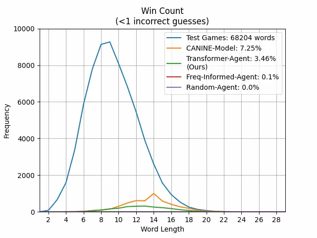

# Transformer-Based AI Agent for Playing Hangman

This project presents a novel formulation of the classic Hangman game as a <strong>sequential decision-making problem</strong>. A <strong>Transformer-based AI agent</strong> is trained to play Hangman by predicting the <em>conditional probability distribution</em> of the next character guess, given a <strong>partially masked word</strong> and the <strong>history of previous guesses</strong>.

The model is optimized to:
- Minimize duplicate guesses.
- Maximize guess efficiency.
- Adapt across word lengths and vocabulary without pretraining.

📄 Read the full <a href="Report.pdf">project report</a> for details on dataset design, model architecture, training pipeline, and results.

---

## 🧠 Core Idea

Instead of treating Hangman as a static classification task, we approach it as a **sequence modeling problem**, where the agent:
- Receives a masked version of the word.
- Uses Transformer-based encoder-decoder architecture to model the game's state.
- Learns a **custom loss function** incorporating both binary cross-entropy and a **duplicate penalty** to reduce repeated guesses.

---

## 🧩 Model Architecture

- **Transformer Encoder**: Processes the masked word using self-attention and positional encodings.
- **Transformer Decoder**: Generates the next guess conditioned on prior guesses and encoder context.
- **Output**: A probability distribution over the 26 lowercase English letters.

---

## 📊 Results

The AI agent achieves best compared to both heuristic and learned baselines for allowed incorrect guesses < 6:

| Agent               | Win Rate | Params     | Weight Updates | Guess History Used | Pretrained |
|--------------------|----------|------------|----------------|---------------------|------------|
| Random Agent        | 0.4%     | NA         | NA             | ❌                  | ❌         |
| Frequency-Informed  | 5.3%     | NA         | NA             | ❌                  | ❌         |
| CANINE (Google)     | 54.5%    | ~121M      | ~5.3M          | ❌                  | ✅         |
| **Transformer (Ours)** | **55.4%** | **~1.2M**  | **~2.4M**      | ✅ (via decoder)     | ❌         |

- Weight Updates = Total batches seen during training.
- ❌ in "Guess History Used" also means output probabilities are hard masked with the previous guesses to avoid duplicate guesses. 
---

## 🎮 Animation of Win Distribution

